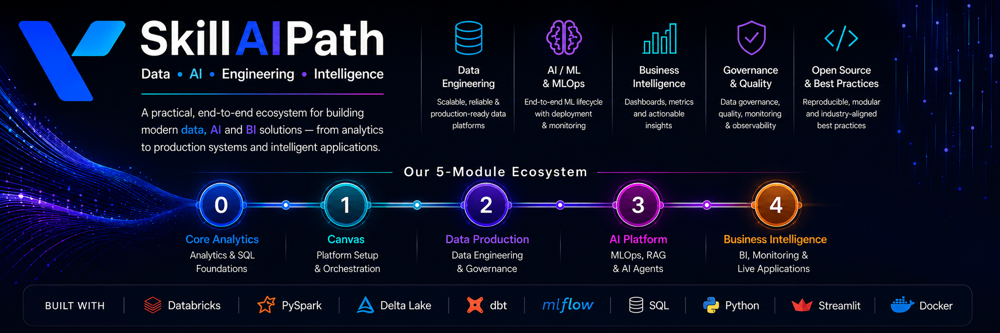

<p align="center">
  
</p>

<p align="center">
  
</p>

# SkillAIPath

### A Practical, End-to-End Data Engineering, AI & BI Ecosystem

Built as a hands-on learning and production platform covering analytics, orchestration, data engineering, AI/ML, MLOps, and business intelligence.

[](https://github.com/YOUR_USERNAME/SkillAIPath)
[](https://www.python.org/)
[](https://www.databricks.com/)
[](https://spark.apache.org/)
[](https://www.getdbt.com/)
[](https://mlflow.org/)

---

## About

**SkillAIPath** is a structured, five-module repository designed to demonstrate the complete modern data and AI lifecycle.

The platform progresses from foundational analytics and platform orchestration to production-style data engineering, AI/ML and MLOps, and finally business intelligence, observability, and live applications.

Each module is designed to be self-contained while building toward a complete production-oriented ecosystem.

---

## Ecosystem Overview

| Module | Focus | Key Areas |
|---|---|---|
| **0. Core Analytics** | Foundational Analytics | SQL, Business Analysis, EduFin Case Study |
| **1. Canvas** | Platform Foundation | Setup, Orchestration, Apps, External Data |
| **2. Data Production** | Production Data Engineering | Medallion, Unity Catalog, dbt, Quality, Monitoring |
| **3. AI Platform** | AI / ML & MLOps | ML Training, Serving, RAG, AI Agents |
| **4. Business Intelligence** | BI & Observability | Monitoring, Dashboards, Streamlit Applications |

---

# 0. Core Analytics

`0_Core_Analytics/`

A guided analytics case study built around **EduFin**, a fictional education lender, designed to practice real-world analytical problem solving and business decision-making.

### What's Included

**SQL & Analytics**  
SQL Fundamentals · JOINs · Aggregations · Filtering · CTEs

**Risk & Portfolio Analysis**  
Portfolio Health · Customer Risk · Time Analysis · Cost Tracking

**Learning & Workflow**  
`00_Start_Here.md` · Structured Onboarding · Business-Focused Analytical Workflows

### Technology


---

# 1. Canvas

`1_Canvas/`

The platform foundation layer used for environment setup, orchestration, reusable application patterns, and external data ingestion.

### What's Included

**Platform Foundation**  
Environment Configuration · Synthetic Data Generation · Architecture Diagrams

**Pipeline & Orchestration**  
Full-Load Pipeline Orchestration · Incremental Pipeline Orchestration

**Application Patterns**  
Reusable Application Templates · Realtime Monitoring Patterns · Predictive Analytics Applications · Executive Reporting

**Business Workflows**  
Supply Chain API Patterns · Automated Reorder Workflows · Gold Analytics Dashboard Patterns

**External Data**  
External Data Ingestion · Supplier Data · Weather Data · Exchange-Rate Data · Logistics Data

### Application Templates

The Canvas module contains reference implementations for multiple production-style application patterns:

- Realtime Monitoring
- Predictive Analytics
- Executive Reporting
- Supply Chain API
- Automated Reorder
- Gold Analytics Dashboard
- Reference Application Patterns
- Orchestration Applications

Several applications are containerized using Docker.

### Technology


---

# 2. Data Production

`2_Data_Production/`

A production-oriented data platform built around the **Medallion Architecture**, with governance, transformation, data quality, synchronization, and operational monitoring.

### What's Included

#### Unity Catalog Governance

**Governance & Security**  
Catalog & Schema Management · Iceberg / UniForm Setup · Governance Patterns · Secrets Management · PII Masking · Access-Control Patterns

#### Medallion Architecture

**Data Layers & Modeling**  
Bronze Ingestion · Silver Transformations · Gold Data Products · Dimension Modeling · Fact Modeling · Streaming CDC · Gold-Layer Aggregations · Analytical Views

#### dbt Project

The `sap_dw` dbt project includes:

**dbt Development**  
Staging Models · Intermediate Models · Mart Models · Macros · Seeds · Tests · Transformation Workflows

#### Data Quality & Operations

**Quality & Testing**  
Quality Gates · Validation Framework · Data Validation · Optimization Routines · Automated Checks · Pytest-Based Testing

#### OLTP ↔ OLAP Synchronization

**Data Synchronization**  
REST API Ingestion · OAuth Authentication · Paginated API Extraction · OLTP-to-OLAP Synchronization · Incremental Synchronization Patterns

#### Monitoring & Governance

**Operations & Observability**  
Troubleshooting Runbooks · Logging · Alerting · Audit Trail Queries · Time-Travel Recovery · Data Profiling · Data Drift Detection · Operational Monitoring

### Technology


---

# 3. AI Platform

`3_AI_Platform/`

The AI and machine learning layer of SkillAIPath, covering model development, MLOps, deployment, retrieval-augmented generation, and AI agents.

### MLOps

Training and deployment workflows for:

- Churn Prediction
- Product Recommendation
- Demand Forecasting
- Next Purchase Prediction

The MLOps workflows also cover:

- Model training
- Experiment tracking
- Model deployment
- REST API inference
- Batch inference
- Real-time inference
- Batch vs. real-time comparison
- A/B testing

### RAG Pipeline

Retrieval-Augmented Generation workflows for:

- Customer 360
- Ecommerce Intelligence
- Knowledge Retrieval

### AI Agents

Includes reference implementations for:

- SAP Knowledge Agent
- RAG-based agents
- Domain-specific agent templates

### Technology


---

# 4. Business Intelligence

`4_Business_Intelligence/`

The business intelligence, observability, monitoring, and application layer of the ecosystem.

### Platform Observability

Includes monitoring patterns for:

**Monitoring & Metrics**  
Cost Tracking · Custom Metrics · Data Quality · Lakehouse Monitoring · ML Monitoring · Performance Monitoring

**Operations**  
Incident Management · Operational Runbooks

### BI Production

**Business Intelligence**  
Dashboard Setup · BI Data Operations · Analytical Reporting · Production-Oriented Dashboard Workflows

### Live Applications

The repository includes two Streamlit applications:

- **PR Reviewer**
- **Team Operations Center**

These demonstrate how data and AI workflows can be exposed through usable business-facing applications.

### Technology


---

# Technology Stack

| Category | Technologies |
|---|---|
| **Languages** |   |
| **Data Analysis** |    |
| **Data Engineering** |     |
| **Machine Learning & AI** |    |
| **BI & Visualization** |   |
| **Application & APIs** |   |
| **Infrastructure & Testing** |    |

---

# Repository Structure

```text
SkillAIPath/
│
├── 0_Core_Analytics/
│   ├── SQL Fundamentals
│   ├── EduFin Analysis
│   └── 00_Start_Here.md
│
├── 1_Canvas/
│   ├── Setup
│   ├── Data Generation
│   ├── Orchestration
│   ├── App Templates
│   ├── External Sources
│   └── Architecture Diagrams
│
├── 2_Data_Production/
│   ├── Unity Catalog
│   ├── Medallion Architecture
│   ├── dbt
│   ├── Data Quality
│   ├── OLTP-OLAP Sync
│   └── Monitoring & Governance
│
├── 3_AI_Platform/
│   ├── MLOps
│   ├── Model Training
│   ├── Model Serving
│   ├── RAG
│   └── AI Agents
│
├── 4_Business_Intelligence/
│   ├── Platform Observability
│   ├── BI Production
│   └── Live Streamlit Apps
│
└── README.md
